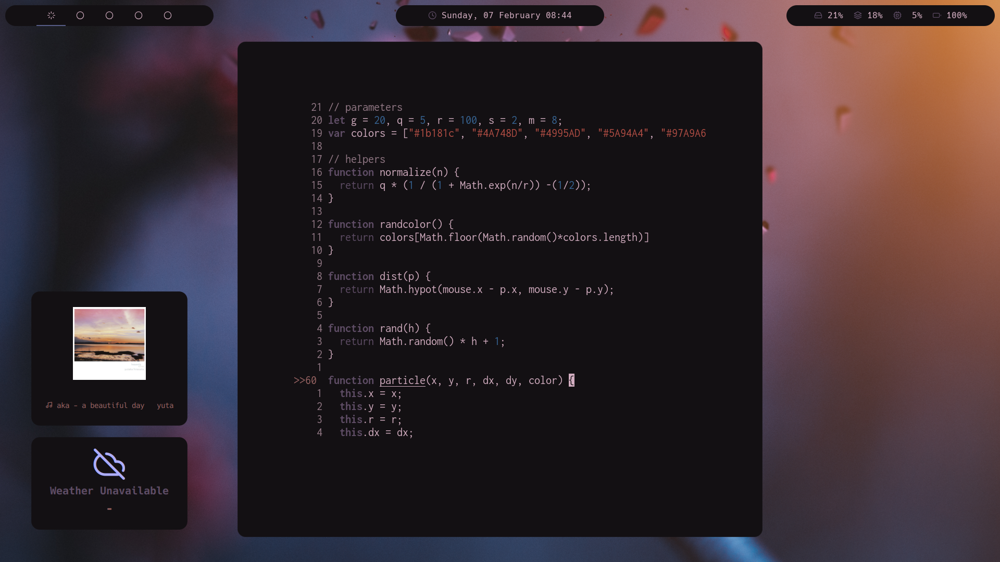

# Linux Setup
**NOTE:** *heavily* personalized; target audience: me. Do everything here in and you should have an identical environment.

Glam Screenshots; weather API died :'(



## Main configs and Look & Feel

### software deps and basic setup
- install arch, base, base-devel, linux, linux-firmware, grub, efibootmgr, networkmanager, openssh, git, etc...
- enable services:
  - `` systemctl enable NetworkManager ``
  - `` systemctl enable sshd ``
- make a user, log in and in ~ do:
  - Remove all of ~ with `` rm -rf * ``
  - Copy dots: `` git clone https://github.com/JSmol/dots.git . ``
  - Make dirs: `` mkdir downloads pictures dev ``
- Install software: `` sh ~/.config/scripts/arch/install.sh `` **NOTE:** This installs a lot of stuff
- Change shell: `` chsh -s `which fish` ``

### aur packages
- Install these aur packages; in ~/downloads do:
  - Spotify: `` git clone https://aur.archlinux.org/spotify.git ``
  - Compositer: `` git clone https://aur.archlinux.org/picom-ibhagwan-git.git ``
  - Prompt: `` git clone https://aur.archlinux.org/starship.git ``
  - Status Bar: `` git clone https://aur.archlinux.org/polybar.git ``
  - Widgets: `` git clone https://aur.archlinux.org/eww-git.git ``
    - **NOTE:** You may need to run `` rustup install nightly `` before `` makepkg `` for eww
- Use `` makepkg -sic `` in each directory

### python executables
- Ensure that `` ~/.local/bin `` is in the PATH variable! (*should* happen automatically on fish configuration)

### vim & neovim
- Run `` pip install pynvim ``
- Run `` curl -fLo ~/.vim/autoload/plug.vim --create-dirs \
    https://raw.githubusercontent.com/junegunn/vim-plug/master/plug.vim ``
- In vim/nvim run `` :PlugInstall ``
- In nvim run `` :CocInstall coc-html coc-css coc-tsserver coc-vetur `` and `` :UpdateRemotePlugins ``

### pywal
- `` pip install pywal `` and populate `` ~/pictures/vibes `` with cool images

### icons and cursor
- Icons: `` mkdir .icons ``
  - Run in ~/.icons: `` git clone https://github.com/EliverLara/candy-icons ``
  - If you want fancy cursor: https://github.com/ful1e5/Bibata_Cursor

### weather widget
- Weather widget; in /etc/systemd/system/ do:
- `` sudo vim weather.service `` and write
```
[Unit]
Description=Weather

[Service]
ExecStart=/home/josip/.config/scripts/weather.sh
```
- `` sudo vim weather.timer `` and write 
```
[Unit]
Description=Weather Timer

[Timer]
OnBootSec=0min
OnCalendar=*-*-* *:00:00
Unit=weather.service

[Install]
WantedBy=timers.target
```
- Enable with: `` systemctl enable weather.timer ``
- make a token file `` weather.token `` in scripts

### firefox
- Run `` pip install pywalfox `` and `` pywalfox install ``

## Workflow & Software tools

### gh cli
- Run `` gh auth login ``
  
### gcp sdk
- This link https://cloud.google.com/sdk/docs/install#linux

### firebase cli
- Run `` sudo npm i firebase-tools ``
  - **NOTE:** At the time of writing, some features require downgrading to node12.
  - Consider installing `` nodejs-lts-erbium `` with pacman
